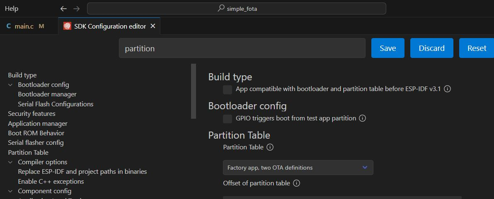
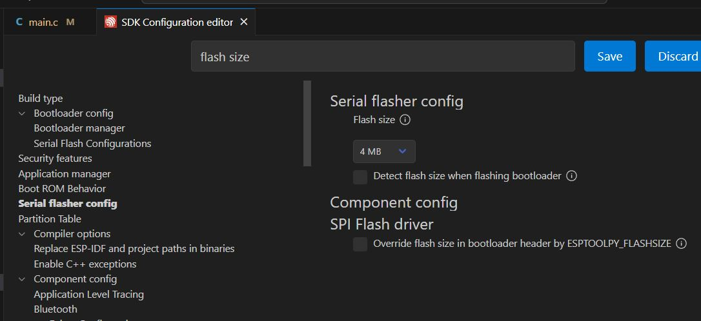

# _Sample project_

## Troubleshooting

### Check the partition
If you see the `Passive OTA partition not found` message during download the new firmware, Go to SDK configuration editor and change the partition like this.

### Passive OTA partition not found
Make sure you have enough flash size, you should select at least 4MB flash size for normal OTA.

