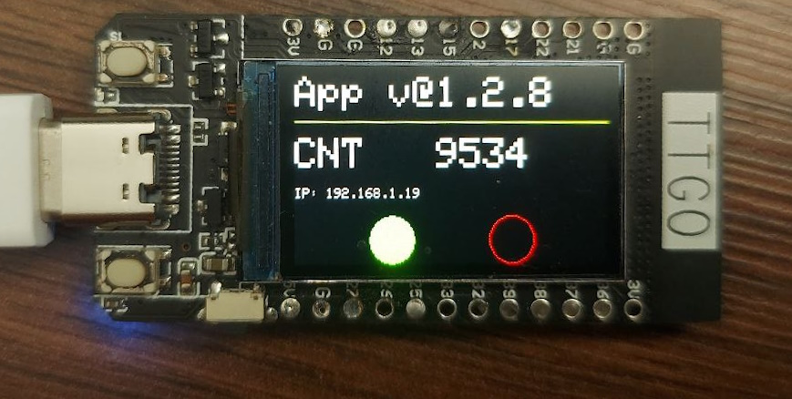
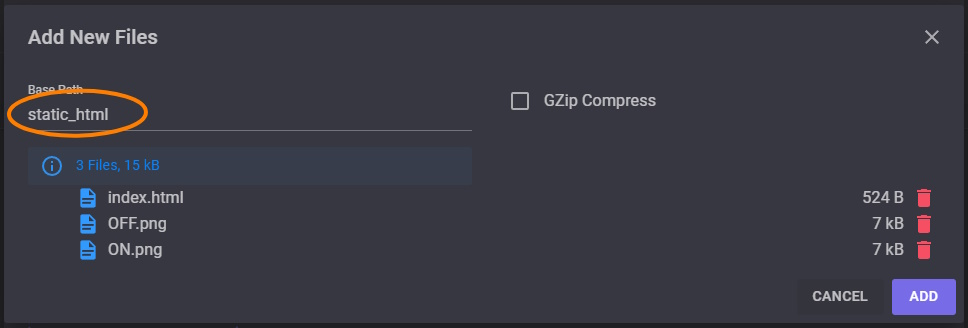
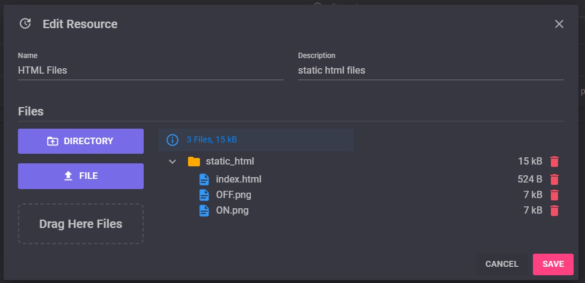

# Advanced HTML Server ON ESP32
  
In this example we are trying to implement an advanced HTML server on our TTGO/LILYGO board to control two lamps (Red & Green).  

  

## Create your resource
You have to upload the files in the `HTML` folder as a resource in your project. The HTML file and images will download and save to SPIFFS (user area), after first time the MCU starts.  
  
  
